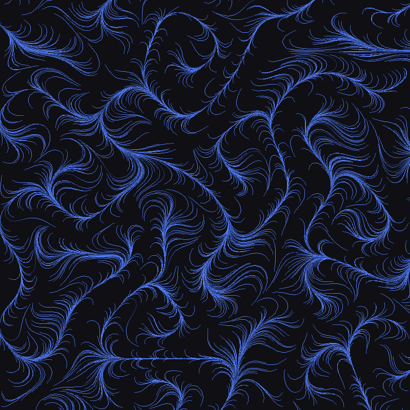
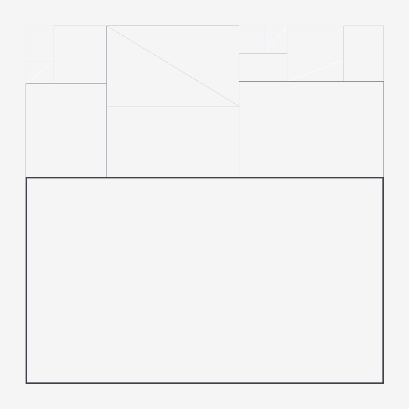
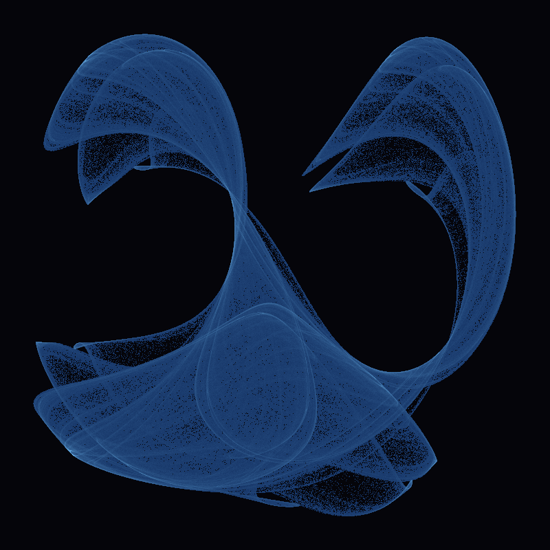
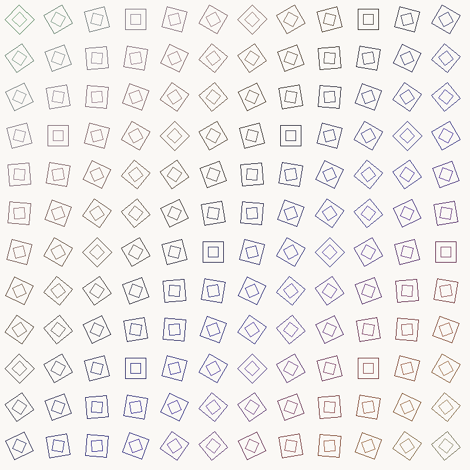
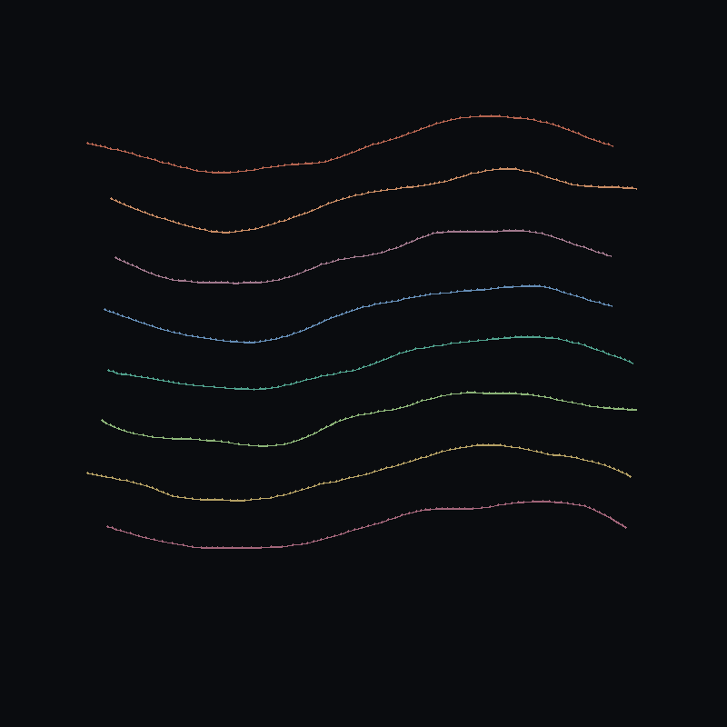

# Procedural Algorithmic Art Collection

**Generated:** April 16, 2026  
**Tools:** Python + Pillow (no AI image generation)  
**Inspirations:** Manfred Mohr, Vera Molnár, Jared Tarbell

---

## Overview

This collection explores purely code-based visual aesthetics through mathematical patterns, noise functions, geometric abstraction, and emergent complexity. Each piece is generated deterministically from simple rules that create intricate results.

---

## Piece 1: Perlin Flow Fields



### Technique
**Flow fields following Perlin noise vectors.** 2,000 particles trace invisible currents across the canvas, their paths determined by underlying vector fields derived from noise functions.

### Parameters
- **Particles:** 2,000
- **Max steps per particle:** 100
- **Noise scale:** 0.005
- **Step size:** 2 pixels
- **Color gradient:** Blue-green tones fading with step count

### Implementation
```python
class PerlinNoise:
    def __init__(self, seed=42):
        random.seed(seed)
        self.p = list(range(256))
        random.shuffle(self.p)
        self.p = self.p + self.p
    
    def noise(self, x, y):
        # Classic Perlin noise with fade/lerp/grad functions
        X, Y = int(x) & 255, int(y) & 255
        x -= int(x)
        y -= int(y)
        # ... gradient interpolation logic

# Particle tracing
for start_x, start_y in particles:
    x, y = float(start_x), float(start_y)
    for step in range(max_steps):
        angle = perlin.noise(x * scale, y * scale) * 2 * math.pi * 2
        next_x = x + math.cos(angle) * step_size
        next_y = y + math.sin(angle) * step_size
        draw.line([(x, y), (next_x, next_y)], ...)
```

### Emergent Qualities
The individual particle paths appear chaotic, but together they reveal the underlying flow field structure. Rivers and whorls emerge organically—where particles converge, darker paths form; where they diverge, negative space opens up. The aesthetic resembles natural phenomena: water currents, wind patterns, or magnetic field lines visualized through iron filings.

### Artistic Reference
Echoes **Jared Tarbell's** work on flow fields and **Manfred Mohr's** algorithmic line studies, but with an organic rather than geometric approach.

---

## Piece 2: Recursive Subdivision



### Technique
**Random recursive subdivision** inspired by Manfred Mohr's cube-based geometric works. Space is repeatedly split along random lines, creating an emergent architectural grid.

### Parameters
- **Max recursion depth:** 6 levels
- **Split probability:** 70% per level
- **Split position:** Random within middle third (33%-66%)
- **Line weight:** Decreases with depth (4px → 1px)
- **Diagonals:** 40% of cells get internal diagonals

### Implementation
```python
@dataclass
class Rect:
    x: int; y: int; w: int; h: int; depth: int

def subdivide(rect: Rect, max_depth: int = 6):
    if rect.depth >= max_depth or random.random() > 0.7:
        return [rect]
    
    if rect.w > rect.h:  # Split along longer dimension
        split_x = rect.x + random.randint(rect.w // 3, rect.w * 2 // 3)
        left = Rect(rect.x, rect.y, split_x - rect.x, rect.h, rect.depth + 1)
        right = Rect(split_x, rect.y, rect.x + rect.w - split_x, rect.h, rect.depth + 1)
        return subdivide(left, max_depth) + subdivide(right, max_depth)
    # ... vertical split case
```

### Emergent Qualities
Despite the random splitting, a clear hierarchy emerges: larger divisions frame smaller ones. The varying line weights create depth—thick borders contain thin subdivisions. When diagonals appear, they create visual tension against the orthogonal grid. The overall effect resembles architectural plans, Mondrian paintings, or circuit board layouts—order emerging from stochastic decisions.

### Artistic Reference
Directly inspired by **Manfred Mohr's** "Cubic Limit" series and **Vera Molnár's** square subdivisions. The controlled randomness follows Molnár's systematic approach to variation.

---

## Piece 3: Clifford Attractor



### Technique
**Iterated Function System** - the Clifford attractor. Two simple trigonometric equations produce infinitely complex, ghostly curves when iterated millions of times.

### Parameters
- **Equations:**
  - `xₙ₊₁ = sin(a·yₙ) + c·cos(a·xₙ)`
  - `yₙ₊₁ = sin(b·xₙ) + d·cos(b·yₙ)`
- **Coefficients:** a=-1.4, b=1.6, c=1.0, d=0.7
- **Iterations:** 2,000,000 points
- **Rendering:** Density-based with cyan-blue color gradient

### Implementation
```python
# Clifford attractor
def clifford_attractor():
    a, b, c, d = -1.4, 1.6, 1.0, 0.7
    x, y = 0.0, 0.0
    
    # First pass: find bounds
    points_x, points_y = [], []
    for _ in range(10000):
        x_new = math.sin(a * y) + c * math.cos(a * x)
        y_new = math.sin(b * x) + d * math.cos(b * y)
        x, y = x_new, y_new
        points_x.append(x)
        points_y.append(y)
    
    min_x, max_x = min(points_x), max(points_x)
    min_y, max_y = min(points_y), max(points_y)
    
    # Second pass: accumulate density
    density = [[0 for _ in range(SIZE)] for _ in range(SIZE)]
    x, y = 0.0, 0.0
    for _ in range(2000000):
        x_new = math.sin(a * y) + c * math.cos(a * x)
        y_new = math.sin(b * x) + d * math.cos(b * y)
        x, y = x_new, y_new
        px = int(margin + (x - min_x) * scale_x)
        py = int(margin + (y - min_y) * scale_y)
        if 0 <= px < SIZE and 0 <= py < SIZE:
            density[py][px] += 1
    
    # Render with color based on density
    for py in range(SIZE):
        for px in range(SIZE):
            d_val = density[py][px]
            if d_val > 0:
                intensity = min(1.0, (d_val / max_density) ** 0.5)
                pixels[px, py] = (20 + 100*i, 50 + 150*i, 100 + 155*i)
```

### Emergent Qualities
The Clifford attractor is deterministic—same inputs always produce same outputs—yet the resulting pattern feels organic and unpredictable. Dense regions form "bones" and "ribs"; sparse regions create negative space that reads as atmosphere. The density-based rendering gives it a luminous, almost bioluminescent quality. The pattern never intersects itself chaotically; instead, it creates a coherent, twisted ribbon structure.

### Artistic Reference
Attractor visualization connects to **computer art pioneers** exploring chaos theory in the 1980s. The aesthetic resembles microscopic photography or astronomical imagery—patterns that feel discovered rather than designed.

---

## Piece 4: Rotating Tessellation



### Technique
**Parametric grid with progressive rotation.** A regular 12×12 grid becomes dynamic through systematic rotation—each cell's angle accumulates based on its position, creating wave-like interference patterns.

### Parameters
- **Grid:** 12 × 12 cells
- **Base rotation:** 0° at (0,0), increasing by 15° per column and 10° per row
- **Inner square:** Rotates opposite direction, 50% size
- **Colors:** Subtle variations based on position using sine waves

### Implementation
```python
def rotating_tessellation():
    cols, rows = 12, 12
    cell_w = SIZE // cols
    cell_h = SIZE // rows
    margin = 8
    
    for row in range(rows):
        for col in range(cols):
            x = col * cell_w + cell_w // 2
            y = row * cell_h + cell_h // 2
            
            # Progressive rotation
            angle = (col * 15 + row * 10) * math.pi / 180
            
            # Draw rotated square
            size = (cell_w - margin * 2) // 2
            corners = []
            for i in range(4):
                corner_angle = angle + i * math.pi / 2
                cx = x + size * math.cos(corner_angle)
                cy = y + size * math.sin(corner_angle)
                corners.append((cx, cy))
            
            # Color from position
            hue_val = (col + row) * 8
            color = (
                40 + int(60 * math.sin(hue_val * 0.05)),
                40 + int(60 * math.cos(hue_val * 0.03)),
                50 + int(50 * math.sin(hue_val * 0.07))
            )
            draw.polygon(corners, outline=color, fill=None)
            
            # Inner square (opposite rotation)
            inner_size = size * 0.5
            inner_corners = []
            for i in range(4):
                corner_angle = -angle + i * math.pi / 2
                # ... calculate corners
            draw.polygon(inner_corners, outline=(...), fill=None)
```

### Emergent Qualities
The simple rule (rotate more as you move across the grid) produces complex visual rhythms. Diagonals of aligned squares appear unexpectedly. The counter-rotating inner squares create a moiré-like interference pattern. Colors shift subtly across the grid following independent sine waves, creating the impression of a gradient field without explicit gradient calculation. The overall effect is hypnotic—order and variation in perfect balance.

### Artistic Reference
Direct homage to **Vera Molnár's** systematic variation studies and **Manfred Mohr's** early plotter works exploring rotation and subdivision. The parametric approach reflects Molnár's statement: "The machine is not merely a tool, but a collaborator."

---

## Piece 5: Differential Growth



### Technique
**Physics-based line growth with collision avoidance.** Lines grow and push apart like living tissue—bacterial colonies, coral, or leaf veins forming through simple physical rules.

### Parameters
- **Initial lines:** 8 seed curves with 20 nodes each
- **Growth rule:** Insert node when segment length > 12
- **Forces:**
  - Attraction to neighbors (maintains structure): 0.3 strength
  - Repulsion from other lines (collision avoidance): 2.0 strength, radius 15px
  - Damping: 0.9 per iteration
- **Iterations:** 150 growth cycles

### Implementation
```python
@dataclass
class Node:
    x: float; y: float; vx: float = 0; vy: float = 0

def differential_growth():
    # Initialize 8 seed lines
    lines = []
    for i in range(8):
        nodes = []
        center_y = SIZE // 2 + (i - 4) * 60
        for j in range(20):
            t = j / 19
            x = 100 + t * 600 + random.uniform(-20, 20)
            y = center_y + math.sin(t * math.pi * 2) * 30
            nodes.append(Node(x, y))
        lines.append(nodes)
    
    # Growth simulation
    for iteration in range(150):
        new_lines = []
        for line in lines:
            new_line = []
            for i, node in enumerate(line):
                fx, fy = 0.0, 0.0
                
                # Attraction to neighbors
                if i > 0:
                    dx = line[i-1].x - node.x
                    dy = line[i-1].y - node.y
                    d = math.sqrt(dx*dx + dy*dy)
                    if d > 5:
                        fx += dx / d * 0.3
                        fy += dy / d * 0.3
                
                # Repulsion from other lines
                for other_line in lines:
                    if other_line is line:
                        continue
                    for other in other_line:
                        dx = node.x - other.x
                        dy = node.y - other.y
                        d = math.sqrt(dx*dx + dy*dy)
                        if d < 15 and d > 0:
                            fx += dx / d * 2.0
                            fy += dy / d * 2.0
                
                # Apply forces with damping
                node.vx = node.vx * 0.9 + fx * 0.1
                node.vy = node.vy * 0.9 + fy * 0.1
                
                new_line.append(Node(node.x + node.vx, node.y + node.vy, 
                                     node.vx, node.vy))
            
            # Subdivision: insert nodes when segments get too long
            i = 0
            while i < len(new_line) - 1:
                dx = new_line[i+1].x - new_line[i].x
                dy = new_line[i+1].y - new_line[i].y
                d = math.sqrt(dx*dx + dy*dy)
                if d > 12:
                    mid = Node((new_line[i].x + new_line[i+1].x) / 2,
                               (new_line[i].y + new_line[i+1].y) / 2)
                    new_line.insert(i+1, mid)
                i += 1
            
            new_lines.append(new_line)
        lines = new_lines
```

### Emergent Qualities
The interplay between growth (subdivision) and constraint (repulsion) creates organic branching patterns. Lines compete for space, pushing each other into curved, flowing forms. The color palette—warm earth tones—enhances the biological metaphor. The result resembles neural networks, river deltas, or fungal mycelium. Most remarkably, the forms appear to "breathe"—even as static images, they suggest ongoing growth and adaptation.

### Artistic Reference
Connects to **Jared Tarbell's** work on growth algorithms and Nervous System's generative design. The biological aesthetic mirrors scientific visualization while maintaining artistic abstraction.

---

## Technical Notes

### Reproducibility
All pieces use `random.seed(42)` for deterministic output. The same code will always produce the same images.

### Performance
- **Flow Fields:** Fast (< 1s) - simple particle tracing
- **Recursive Subdivision:** Fast (< 1s) - logarithmic recursion
- **Clifford Attractor:** Slow (~10s) - 2M iterations with density accumulation
- **Rotating Tessellation:** Fast (< 1s) - simple geometric transforms
- **Differential Growth:** Medium (~3s) - physics simulation with nested loops

### Dependencies
- Python 3.x
- Pillow (PIL)
- math, random (stdlib)

### Color Palettes
All palettes were chosen to reflect the artistic references:
- **Mohr-inspired:** Monochromatic, architectural
- **Molnár-inspired:** High contrast, systematic
- **Organic:** Bioluminescent, warm earth tones

---

## Conclusion

These five pieces demonstrate that purely algorithmic generation can produce visual complexity rivaling AI-generated imagery—while remaining fully deterministic, editable, and conceptually grounded in the history of computer art. Each piece encodes a different kind of emergence: noise fields revealing invisible structure, recursion creating hierarchy, chaos equations producing coherence, parametric rules generating rhythm, and simple physics simulating life.

The code is the art; the images are merely its output.
